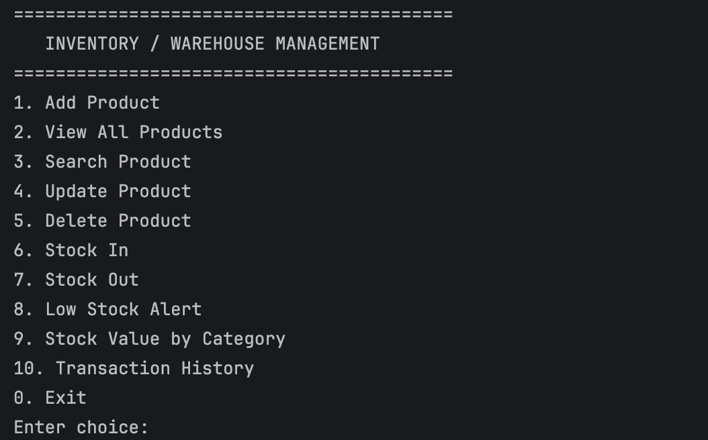
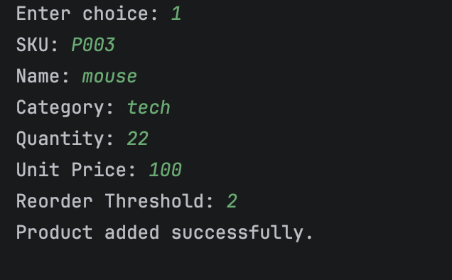
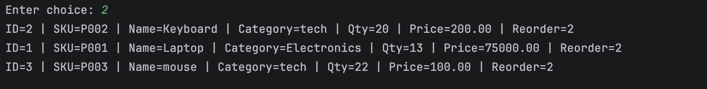
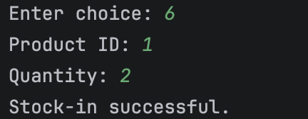
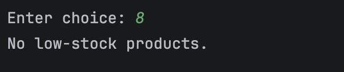
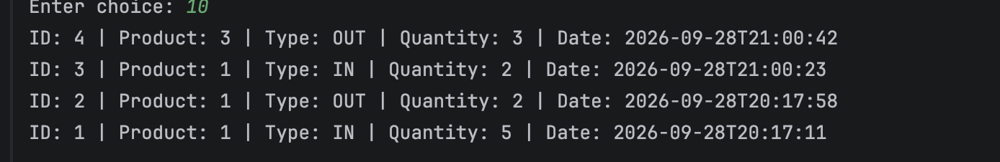

# Inventory Management System

A terminal-based inventory / warehouse management application built with *core Java* and *JDBC* (MySQL). It lets you manage products, record stock coming in and going out, and get quick reports such as low-stock alerts and stock value per category.

Built as the Java course project (OOP, Collections, JDBC) by *Rabin Tamrakar*, Techspire College.

---

## Features

•⁠  ⁠*Add, view, update and delete products* (with a confirmation prompt before deleting)
•⁠  ⁠*Search* products by name, SKU, or category
•⁠  ⁠*Stock In / Stock Out* with automatic transaction records
•⁠  ⁠*Low stock alert* for products below their reorder threshold
•⁠  ⁠*Stock value by category* (quantity × unit price, grouped by category)
•⁠  ⁠*Transaction history* showing every stock-in and stock-out
•⁠  ⁠*Input validation*: no empty fields, no negative quantities or prices, no duplicate SKUs, no stock-out larger than current stock
•⁠  ⁠*Clear error messages* through custom exceptions instead of crashes

## Tech Stack

| Area | Technology |
|------|------------|
| Language | Java (JDK 15 or higher, uses text blocks) |
| Database | MySQL |
| Database access | JDBC with ⁠ PreparedStatement ⁠ |
| Driver | MySQL Connector/J (included in ⁠ lib/ ⁠) |
| Interface | Console (terminal menu) |

## Java Concepts Used

•⁠  ⁠*OOP*
- Encapsulation: model classes with private fields and getters/setters
- Inheritance: ⁠ StockInTransaction ⁠ and ⁠ StockOutTransaction ⁠ extend ⁠ Transaction ⁠
- Interface: ⁠ Product ⁠ implements ⁠ Stockable ⁠
- Custom checked exceptions: ⁠ ProductNotFoundException ⁠, ⁠ DuplicateSkuException ⁠, ⁠ InsufficientStockException ⁠
  •⁠  ⁠*Collections*: ⁠ List ⁠ / ⁠ ArrayList ⁠ for results, ⁠ Map ⁠ / ⁠ HashMap ⁠ for stock value per category, ⁠ Comparator ⁠ for sorting products by name
  •⁠  ⁠*JDBC*: ⁠ DriverManager ⁠, ⁠ PreparedStatement ⁠, ⁠ ResultSet ⁠, try-with-resources, and a properties file for credentials
  •⁠  ⁠*Layered design*: UI → Service → DAO → Database, so each layer has one job

## Project Structure

inventory-system/
├── src/
│   ├── main/
│   │   └── Main.java                    # Entry point
│   ├── ui/
│   │   └── InventoryMenu.java           # Console menu and input handling
│   ├── service/
│   │   └── InventoryService.java        # Business rules and validation
│   ├── dao/
│   │   ├── ProductDAO.java              # Product SQL queries
│   │   └── TransactionDAO.java          # Transaction SQL queries
│   ├── model/
│   │   ├── Stockable.java               # Interface
│   │   ├── Product.java
│   │   ├── Transaction.java
│   │   ├── StockInTransaction.java
│   │   └── StockOutTransaction.java
│   ├── exception/
│   │   ├── ProductNotFoundException.java
│   │   ├── DuplicateSkuException.java
│   │   └── InsufficientStockException.java
│   └── util/
│       └── DBConnection.java            # Reads db.properties, opens connections
├── lib/                                 # JDBC driver JAR
├── screenshots/                         # Screenshots used in this README
├── schema.sql                           # Database creation script
├── db.properties.example                # Template for database settings
└── README.md

## Database

The app uses a database called ⁠ inventory_db ⁠ with two tables:

•⁠  ⁠*⁠ products ⁠*: SKU (unique), name, category, quantity, unit price, reorder threshold
•⁠  ⁠*⁠ stock_transactions ⁠*: which product, type (⁠ IN ⁠ / ⁠ OUT ⁠), quantity, and date/time. Linked to ⁠ products ⁠ by a foreign key.

The full script is in [⁠ schema.sql ⁠](schema.sql).

## Setup and Run

### Prerequisites

•⁠  ⁠JDK 15 or higher (⁠ java -version ⁠ to check)
•⁠  ⁠MySQL Server running locally
•⁠  ⁠Git

### 1. Clone the repository

⁠ bash
git clone <your-repo-url>
cd inventory-system
 ⁠

### 2. Create the database

⁠ bash
mysql -u root -p < schema.sql
 ⁠

### 3. Configure the database connection

Copy the example file and put in your own MySQL details:

⁠ bash
cp db.properties.example db.properties
 ⁠

⁠ properties
db.url=jdbc:mysql://localhost:3306/inventory_db
db.username=your_mysql_username
db.password=your_mysql_password
 ⁠

⁠ db.properties ⁠ is listed in ⁠ .gitignore ⁠, so your password is never committed.

### 4. Compile

*macOS / Linux*
⁠ bash
mkdir -p out
javac -cp "lib/mysql-connector-j-26.7.0.jar" -d out $(find src -name "*.java")
 ⁠

*Windows (PowerShell)*
⁠ powershell
mkdir out
javac -cp "lib/mysql-connector-j-26.7.0.jar" -d out (Get-ChildItem -Recurse src -Filter *.java).FullName
 ⁠

### 5. Run

Run it from the project root, because ⁠ db.properties ⁠ is read from the current folder.

*macOS / Linux*
⁠ bash
java -cp "out:lib/mysql-connector-j-26.7.0.jar" main.Main
 ⁠

*Windows*
⁠ powershell
java -cp "out;lib/mysql-connector-j-26.7.0.jar" main.Main
 ⁠

Alternatively, open the folder in IntelliJ IDEA, add the JAR in ⁠ lib/ ⁠ as a library, and run ⁠ main.Main ⁠.

## Usage

The program shows a numbered menu. Type a number and press Enter:

======================================
INVENTORY MANAGEMENT SYSTEM
======================================
1. Add Product
2. View All Products
3. Search Product
4. Update Product
5. Delete Product
6. Stock In
7. Stock Out
8. Low Stock Alert
9. Stock Value by Category
10. Transaction History
0. Exit
   ======================================

## Screenshots

*Main menu*

*Adding a product*

*Viewing all products*

*Stock in / stock out*

*Low stock alert*

*Transaction history*

## Known Limitations

•⁠  ⁠*Console only*: there is no graphical interface.
•⁠  ⁠*No login or user roles*: anyone who can run the program can change any data.
•⁠  ⁠*Stock updates are not atomic*: updating the quantity and recording the transaction happen as two separate database operations, so a failure between them could leave them out of sync. Wrapping both in a single JDBC transaction would fix this.
•⁠  ⁠*New connection per query*: there is no connection pooling, which is fine at this scale but would not suit heavy use.
•⁠  ⁠*Updating a product* asks for every field again, even the ones you don't want to change.
•⁠  ⁠*Transaction history* shows product IDs rather than product names.
•⁠  ⁠*Deleting a product* also deletes its transaction history (⁠ ON DELETE CASCADE ⁠).

## Future Improvements

•⁠  ⁠Use JDBC transactions for stock in / stock out
•⁠  ⁠Show product names in the transaction history
•⁠  ⁠Add a note or reason to each transaction
•⁠  ⁠Export reports to CSV
•⁠  ⁠Add a login system
•⁠  ⁠Add a GUI (JavaFX) or a web front end

## Author

*Rabin Tamrakar*
BSc (Hons) IT, Techspire College, Kathmandu, Nepal
GitHub: [rabintmalla](https://github.com/rabintmalla)